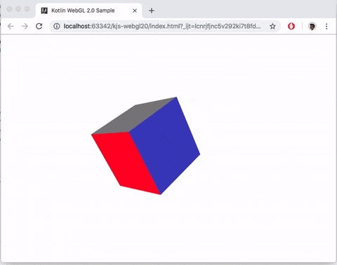

Kotlin Multiplatform Spining Cube

1. `./gradlew assemble`
2. Open index.html

Based on:
 - https://codepen.io/JcersHabs018/pen/QvLoxZ 
 - https://github.com/pabloogc/oktracer/tree/8668e4c992e8e0c89fbdeca85e88a1900b66a999/src/main/kotlin/com/minivac/oktracer/matrix